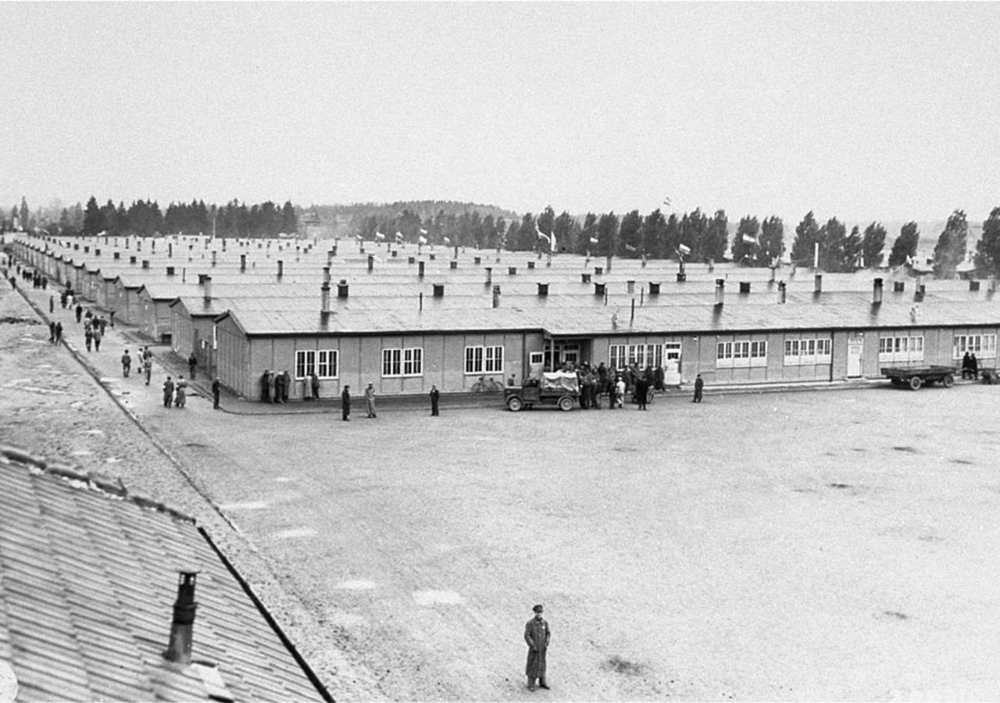

# Archive Lived Lives

## Visits at the IISG
- [Archive visit #1](https://drive.google.com/drive/folders/1xEyiUqV9R-NkfZ8kPi8OIN-Qvtdjhcg7)
- [Archive visit #2](https://drive.google.com/drive/folders/1DO__XSRJpY4XvSEWM5V8nNJd9kC02zep)

---

## Table of Content

1. [ Artefact ](#1)
2. [ Death masks ](#2)
   - [ What is a death mask? ](#2.1)
   - [ L'Inconnue de la Seine ](#2.2)
   - [ Death masks of the famous ](#2.3)
3. [ Herman (Stuuf) Bernard Wiardi Beckman ](#3)
   - [ Who was Beckman ](#3.1)
   - [ Origins of his death mask ](#3.2)
4. [ Transcodings ](#4)

---

 

## 1. Artefact

   *Death mask of Herman (Stuuf) Bernard Wiardi Beckman*

### [Object information of the IISG](https://search.iisg.amsterdam/Record/1013777)

|                      |                                |
|----------------------|--------------------------------|
| Call Number          | IISG BG K21/155                |
| Access               | Limited                        |
| Physical Description | Plaster, 30 cm.                |
| Genres               | Object                         |
| Note                 | Death-Mask                     |
| Subject Person       | Wiardi Beckman, Herman Bernard |

 

## 2. Death masks

### What is a death mask?
*A death mask is a cast of a dead person*, usually made of wax or plaster. Death masks used to preserve the identity of a person, so that, for example, portraits could be made later.

In the late Middle Ages, ambitious princes and ecclesiastical leaders had their portraits spread throughout their empire. It was advertising for themselves, and it legitimized their rule. *A cast of their lifeless face showed that their power, the power of the dynasty, was unbroken even after death*.

From the seventeenth century, when the bourgeoisie became more powerful and self-aware, death masks by scientists, artists and writers were introduced. *More than through painted portraits, they live on after their death*. A well-known example is the death mask of Isaac Newton (1643-1727).

*In the eighteenth century, there was much interest in death masks and they were collected*. Enthusiasts tried to gather as large a collection of "celebrities" as possible and, especially in countries such as England and France, special galleries with masks of famous dead and executed criminals were created.

[SOURCE: Dodenmaskers: herinnering en propaganda ⁠(totzover.nl)](https://www.totzover.nl/ontdek-de-dood/top-13-collectie/dodenmaskers/)

[...] As Nick Reynolds will tell you, death masks began in antiquity — the most famous being the funerary mask of [Tutankhamun.](https://en.wikipedia.org/wiki/Mask_of_Tutankhamun) Wealthy Romans ritually kept death masks of their ancestors for display and worship. *The Victorians too were briefly obsessed* — according to the Victorian science of phrenology, you could determine a person's character and personality from the shape of his head. From the 1820s to the 1840s, a leading British phrenologist and mask-maker, James de Ville, accumulated some 2,000 specimens.

[SOURCE: The curious and gruesome art of human death masks (cnn.com)](https://edition.cnn.com/style/article/death-masks/index.html)

### L'Inconnue de la Seine

Death mask of L'Inconnue de la Seine
She's known simply as "L'Inconnue de la Seine" (The unknown woman of the Seine). So the story goes, her body was retrieved from the river in Paris in the 1870s or 1880s -- no one has an exact date. She'd apparently drowned herself. *An attendant at the morgue was so moved by her beauty and youth (she may well have been a teenager) that he ordered a plaster mold of her face.*

In the following decades, *her death mask was much reproduced, in effect becoming an objet d'art.* Among her 20th century admirers were Giacometti, Man Ray, Vladimir Nabokov and Albert Camus referred to her as the "drowned Mona Lisa."

[SOURCE: The curious and gruesome art of human death masks (cnn.com)](https://edition.cnn.com/style/article/death-masks/index.html)

[...] Laerdal kept the name of his Anne doll, but gave the new mannequin L'Inconnue's face, along with a body of full sized adult dimensions – *including a collapsible chest for practising compressions, and open lips to simulate mouth-to-mouth resuscitation.*

[SOURCE: How a Dead Girl in Paris Ended Up With The Most-Kissed Lips in History — Peter Dockrill (sciencealert.com)](https://www.sciencealert.com/how-dead-girl-paris-ended-up-most-kissed-lips-in-history-l-inconnue-de-la-seine-resusci-anne-cpr-annie-death-mask))

### Death mask of the famous

   *Napoleon Bonaparte*

   *Benjamin Franklin*

   *Ludwig van Beethoven*

[SOURCE: 25 Death Masks of the famous and infamous — Lee Rimmer (abroadintheyard.com)](https://www.abroadintheyard.com/25-death-masks-of-the-famous-and-infamous/)

---

 

## 3. Herman (Stuuf) Bernard Wiardi Beckman

### Who was Beckman?

   *Herman (Stuuf) Bernard Wiardi Beckman*

Herman Wiardi Beckman, known as Stuuf, was a prominent member of the Social Democratic Workers' Party (SDAP) and editor-in-chief of De Arbeiderspers newspapers. In World War II he was active in the resistance. Wiardi Beckman did not survive the war. He died on March 15, 1945 in Dachau concentration camp.

### Origins of his death mask

   *Queen Wilhelmina (1880-1962) and Prime Minister Pieter Sjoerds Gerbrandy (1885-1961)*

On a request from *Queen Wilhelmina* and *Prime Minister Gerbrandy*, Wiardi Beckman attempted to escape to England by boat on 18 January 1942. He should have joined the government in exile there, but was arrested on the beach of Scheveningen.

[SOURCE: Herman ‘Stuuf’ Wiardi Beckman (1904-1945) [...] – Redactie (historiek.net)](https://historiek.net/herman-stuuf-wiardi-beckman-1904-1945/78712/)

   *The entrance to Natzweiler camp*

Wiardi Beckman then, as a "Nacht und Nebel" prisoner, ended up in Amersfoort and Vught in concentration camp Natzweiler, where like many other prisoners he had to do heavy work in a quarry. A fellow prisoner, Arie van Soest, who did not work in the quarry and feared that "Stuuf" would succumb to the heavy work, decided to exchange his relatively simple camp job with him. Van Soest later said about this:

> “I had to think about it, but I did it. I had a great respect for Wiardi Beckman. He had everything to possibly become Prime  Minister. ”

[SOURCE: Herman ‘Stuuf’ Wiardi Beckman (1904-1945) [...] – Redactie (historiek.net)](https://historiek.net/herman-stuuf-wiardi-beckman-1904-1945/78712/)

### Prisons and camps where Beckman was detained
- Strafgevangenis ‘Oranjehotel’ Scheveningen (18 januari 1942),
- Polizeiliches Durchgangslager Amersfoort (6 november 1942),
- Concentratiekamp Vught (januari 1943),
- Gevangenis Haaren (11 maart 1943),
- Polizeiliches Durchgangslager Amersfoort (september 1943),
- Concentratiekamp Natzweiler-Struthof (26 oktober 1943),
- Concentratiekamp Dachau (6 september 1944).
- Omgekomen in Dachau op 15 maart 1945.
   
[SOURCE: Herman (Stuuf) Wiardi Beckman – Redactie (verzetsmuseum.org)](https://www.verzetsmuseum.org/museum/nl/tweede-wereldoorlog/themas/geen-nummers-maar-namen/herman-stuuf-wiardi-beckman)

   *Barracks in Dachau, 1945*

July 1944, the politician was transferred to Dachau, where he died on March 15, 1945 from typhoid fever. One of his fellow prisoners, the poet [Ed. Hoornik](https://www.notion.so/sjorsrigters/Typography-b328ac948180403bb94abeba008fc679?p=9aa7284b534a4d8fb8aec2c5e7e9b2fb) (1910-1970), later wrote in an in memoriam:

> “Then he slid his arm gently under mine. Tell me - his voice became warm - to whom I belong. "

<video src="Videos/Steensma.mp4" width="320" height="200" controls preload></video>

