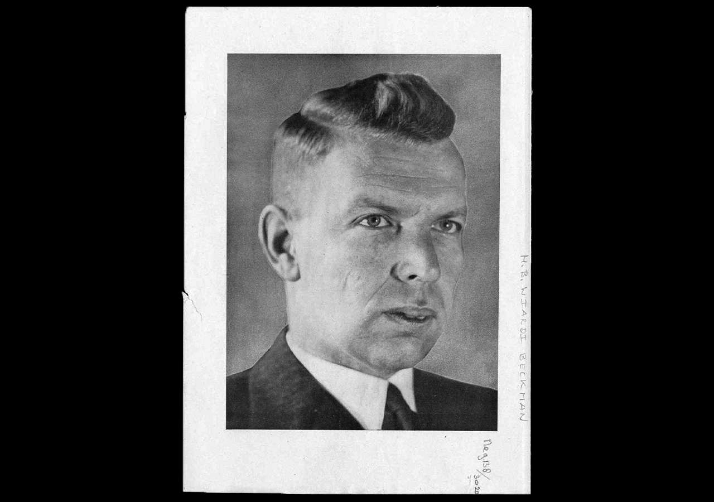
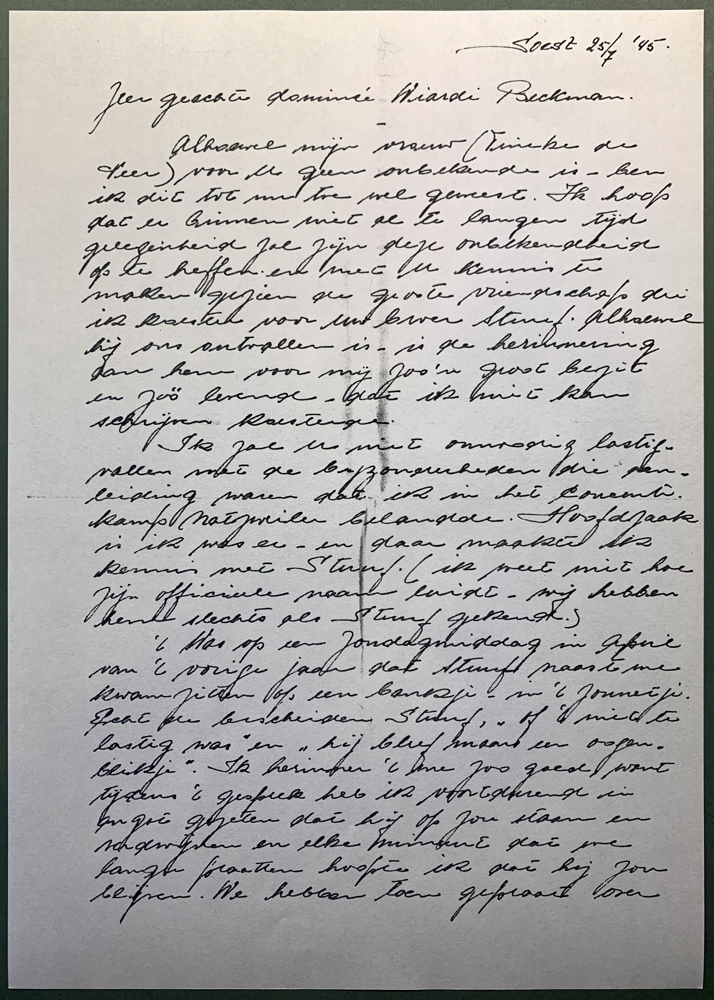

# Archive Lived Lives

## Visits at the IISG
- [Archive visit #1](https://drive.google.com/drive/folders/1xEyiUqV9R-NkfZ8kPi8OIN-Qvtdjhcg7)
- [Archive visit #2](https://drive.google.com/drive/folders/1DO__XSRJpY4XvSEWM5V8nNJd9kC02zep)

---

 

## Table of Content

1. [ Artefact ](#1)
2. [ Death masks ](#2)
   - [ What is a death mask? ](#2.1)
   - [ L'Inconnue de la Seine ](#2.2)
   - [ Death masks of the famous ](#2.3)
3. [ Herman (Stuuf) Bernard Wiardi Beckman ](#3)
   - [ Who was Beckman ](#3.1)
   - [ Origins of his death mask ](#3.2)
   - [ Letters to family Beckman ](#3.3)
4. [ What should we archive ](#4)
   - [ What is important to tell future generations ](#4.1)
   - [ Why is it important to tell? ](#4.2)
   - [ What are the meta topics ](#4.3)
   - [ How to explain meta topics to future generations ](#4.4)
5. [ Transcodings ](#5)
   - [ #1 ](#5.1)
   - [ #2 ](#5.2)

---

 

## 1. Artefact

   *Death mask of Herman (Stuuf) Bernard Wiardi Beckman*

### [Object information of the IISG](https://search.iisg.amsterdam/Record/1013777)

|                      |                                |
|----------------------|--------------------------------|
| Call Number          | IISG BG K21/155                |
| Access               | Limited                        |
| Physical Description | Plaster, 30 cm.                |
| Genres               | Object                         |
| Note                 | Death-Mask                     |
| Subject Person       | Wiardi Beckman, Herman Bernard |

 

## 2. Death masks

### What is a death mask?
*A death mask is a cast of a dead person*, usually made of wax or plaster. Death masks used to preserve the identity of a person, so that, for example, portraits could be made later.

In the late Middle Ages, ambitious princes and ecclesiastical leaders had their portraits spread throughout their empire. It was advertising for themselves, and it legitimized their rule. *A cast of their lifeless face showed that their power, the power of the dynasty, was unbroken even after death*.

From the seventeenth century, when the bourgeoisie became more powerful and self-aware, death masks by scientists, artists and writers were introduced. *More than through painted portraits, they live on after their death*. A well-known example is the death mask of Isaac Newton (1643-1727).

*In the eighteenth century, there was much interest in death masks and they were collected*. Enthusiasts tried to gather as large a collection of "celebrities" as possible and, especially in countries such as England and France, special galleries with masks of famous dead and executed criminals were created.

[SOURCE: Dodenmaskers: herinnering en propaganda ⁠(totzover.nl)](https://www.totzover.nl/ontdek-de-dood/top-13-collectie/dodenmaskers/)

[...] As Nick Reynolds will tell you, death masks began in antiquity — the most famous being the funerary mask of [Tutankhamun.](https://en.wikipedia.org/wiki/Mask_of_Tutankhamun) Wealthy Romans ritually kept death masks of their ancestors for display and worship. *The Victorians too were briefly obsessed* — according to the Victorian science of phrenology, you could determine a person's character and personality from the shape of his head. From the 1820s to the 1840s, a leading British phrenologist and mask-maker, James de Ville, accumulated some 2,000 specimens.

[SOURCE: The curious and gruesome art of human death masks (cnn.com)](https://edition.cnn.com/style/article/death-masks/index.html)

### L'Inconnue de la Seine

Death mask of L'Inconnue de la Seine
She's known simply as "L'Inconnue de la Seine" (The unknown woman of the Seine). So the story goes, her body was retrieved from the river in Paris in the 1870s or 1880s -- no one has an exact date. She'd apparently drowned herself. *An attendant at the morgue was so moved by her beauty and youth (she may well have been a teenager) that he ordered a plaster mold of her face.*

In the following decades, *her death mask was much reproduced, in effect becoming an objet d'art.* Among her 20th century admirers were Giacometti, Man Ray, Vladimir Nabokov and Albert Camus referred to her as the "drowned Mona Lisa."

[SOURCE: The curious and gruesome art of human death masks (cnn.com)](https://edition.cnn.com/style/article/death-masks/index.html)

[...] Laerdal kept the name of his Anne doll, but gave the new mannequin L'Inconnue's face, along with a body of full sized adult dimensions – *including a collapsible chest for practising compressions, and open lips to simulate mouth-to-mouth resuscitation.*

[SOURCE: How a Dead Girl in Paris Ended Up With The Most-Kissed Lips in History — Peter Dockrill (sciencealert.com)](https://www.sciencealert.com/how-dead-girl-paris-ended-up-most-kissed-lips-in-history-l-inconnue-de-la-seine-resusci-anne-cpr-annie-death-mask))

### Death mask of the famous

   *Napoleon Bonaparte*

   *Benjamin Franklin*

   *Ludwig van Beethoven*

[SOURCE: 25 Death Masks of the famous and infamous — Lee Rimmer (abroadintheyard.com)](https://www.abroadintheyard.com/25-death-masks-of-the-famous-and-infamous/)

---

 

## 3. Herman (Stuuf) Bernard Wiardi Beckman

### Who was Beckman?

   *Herman (Stuuf) Bernard Wiardi Beckman*

Herman Wiardi Beckman, known as Stuuf, was a prominent member of the Social Democratic Workers' Party (SDAP) and editor-in-chief of De Arbeiderspers newspapers. In World War II he was active in the resistance. Wiardi Beckman did not survive the war. He died on March 15, 1945 in Dachau concentration camp.

### Origins of his death mask

   *Queen Wilhelmina (1880-1962) and Prime Minister Pieter Sjoerds Gerbrandy (1885-1961)*

On a request from *Queen Wilhelmina* and *Prime Minister Gerbrandy*, Wiardi Beckman attempted to escape to England by boat on 18 January 1942. He should have joined the government in exile there, but was arrested on the beach of Scheveningen.

[SOURCE: Herman ‘Stuuf’ Wiardi Beckman (1904-1945) [...] – Redactie (historiek.net)](https://historiek.net/herman-stuuf-wiardi-beckman-1904-1945/78712/)

   *The entrance to Natzweiler camp*

Wiardi Beckman then, as a "Nacht und Nebel" prisoner, ended up in Amersfoort and Vught in concentration camp Natzweiler, where like many other prisoners he had to do heavy work in a quarry. A fellow prisoner, Arie van Soest, who did not work in the quarry and feared that "Stuuf" would succumb to the heavy work, decided to exchange his relatively simple camp job with him. Van Soest later said about this:

> “I had to think about it, but I did it. I had a great respect for Wiardi Beckman. He had everything to possibly become Prime  Minister. ”

[SOURCE: Herman ‘Stuuf’ Wiardi Beckman (1904-1945) [...] – Redactie (historiek.net)](https://historiek.net/herman-stuuf-wiardi-beckman-1904-1945/78712/)

### Prisons and camps where Beckman was detained
- Strafgevangenis ‘Oranjehotel’ Scheveningen (18 januari 1942),
- Polizeiliches Durchgangslager Amersfoort (6 november 1942),
- Concentratiekamp Vught (januari 1943),
- Gevangenis Haaren (11 maart 1943),
- Polizeiliches Durchgangslager Amersfoort (september 1943),
- Concentratiekamp Natzweiler-Struthof (26 oktober 1943),
- Concentratiekamp Dachau (6 september 1944).
- Omgekomen in Dachau op 15 maart 1945.
   
[SOURCE: Herman (Stuuf) Wiardi Beckman – Redactie (verzetsmuseum.org)](https://www.verzetsmuseum.org/museum/nl/tweede-wereldoorlog/themas/geen-nummers-maar-namen/herman-stuuf-wiardi-beckman)

   *Barracks in Dachau, 1945*

July 1944, the politician was transferred to Dachau, where he died on March 15, 1945 from typhoid fever. One of his fellow prisoners, the poet *Ed. Hoornik* (1910-1970), later wrote in an in memoriam:

> “Then he slid his arm gently under mine. Tell me - his voice became warm - to whom I belong. "

[SOURCE: Herman (Stuuf) Wiardi Beckman – Redactie (verzetsmuseum.org)](https://www.verzetsmuseum.org/museum/nl/tweede-wereldoorlog/themas/geen-nummers-maar-namen/herman-stuuf-wiardi-beckman)

 

*VIDEO: Geen nummers maar Namen - Gijs thema dodenmasker Wiardi Beckman*

*VIDEO: DE ANDEREN - Carel Steensma verteld in een interview met Piet Bleeker over hoe hij in Dachau Wiari Beckman ontmoette.*

After Stuuf's death in Dachau on March 15, 1945, the Polish prisoner *Stanisław Bieńka* made a death mask in the deepest secret of his face. Bieńka was able to arrange the plaster by exchanging cigarettes that he received from Dutch prisoners. The mold was hidden by the Dutch and after the liberation was taken by former prisoner *Con Broers* and handed over to Stuuf's widow. This casting was made with the mold.

### Letters to family Beckman

#### Letter by Con Broers

 

|                      |                                |
|----------------------|--------------------------------|
| Date                 | June 15, 1945                  |
| Writer               | Con Broers                     |
| Location             | Utrecht, NL                    |

---

 

Utrecht 15 Juni 1945

Hooggeachte mevrouw Wiardi Beckman,

Uw schrijven a.d. 6 Juni kwam gisteren in mijn bezit. Het speet mij zeer dat ik niet eerder in was u op te komen zoeken. De Heer Pooellaard, die gelukkig over betere communicatie middelen beschikt dan ik, vertelde mij dat hij u opgezocht had en u ook reeds meegedeeld had dat ik van uw man in Dachau een doodenmasker had laten maken. 

Ik heb met Stuuf door twee concentratiekampen gezworven. Hij is een van mijn beste vrienden geworden. Het was ontzettend voor mij en voor zoovele andere die hem in dien tijd hadden leeren kennen en waarderen, hem zoo kort voor het einde van den oorlog te moeten verliezen. Stuuf die voor ons allen de personificatie van den Hollander was, die met zijn élan ons allen meesleepte, steeds zich zelve bleef en gebleven is tot het laatste toe. Een vriend als geen ander. Het is ook voor mij een ontzaglijk groot gemis. Maandenlang hebben wij in Natzweiler te zamen ... op het zelfde blok. Avonden en halve nachten hebben wij gesproken over onze idealen. Mijn God, wat een vitaliteit, hoe vol zat hij niet met plannen. Hij is voor mij ook een groote steun geweest in het moeilijke lagerleven. Later in Dachau hebben wij eerst tezamen in de quarantaine gezeten in volgepropte barakken in luizen en smerigheid. Maar we hadden een sterke vriendenkring, en ondanks alle Godverlaten ellende om ons heen, hebben we ons nooit teneergeslagen gevoeld. Steeds waren er nieuwe onderwerpen die bij den ..., die we te zamen en met anderen uitploozen en waar ... we ons konden abstraheeren van de werkelijkheid.

Maar reeds spoedig kregen we in Dachau leidende porties. Ik kwam in het hospitaal in het klinisch laboratorium waar ik als bioloog werken kon en hij werd Stube-älteste, had het bewind over een kwart blok en ... 400 menschen.

Ik zag hem toen weinig omdat we het allebei druk hadden. Toen kreeg hij vlektyphus, werd in het revier (hospitaal) opgenomen. Uren hebben zijn vrienden aan zijn bed gezeten. Er is gedaan wat mogelijk was om hem te redden. Het heeft niet ... ... zijn.

Het was iets onbegrijpelijks dat hij er niet meer was. Een doodenmasker wilde ik van hem bewaren, meenemen naar Holland waar ik wist dat zoovelen zijn, die zijn terugkomst verbeidden.

Nu ben ik terug in Holland en het doodenmasker ligt voor mij op tafel. Het is vreemd en onwezenlijk. Ik voel het als een desertie dat ik hier zit en hij er niet meer is.

Veel, heel veel heeft hij mij verteld. Hij heeft mij verteld over U en over zijn gezin, zijn dochters, over dingen die hij verkeerd gedaan had en die hij beter wilde doen wanneer hij terug was. Al die dingen die wij stuk voor stuk zelf voelden dat wij ook verkeerd gedaan hadden en die wij ook hoopten later beter te doen...

Zodra het mij  mogelijk is kom ik u opzoeken. Het is heerlijk over hem te praten met andere menschen die ook van hem gehouden hebben. Ik zal het doodenmasker meebrengen en het u toonen. U bent de enigste die er recht op heeft.

Mijn plan is hier in Holland door een beeldhouwer meerdere afgietsels er van te laten maken. Mijn bedoeling is ook om Heer ..., als een ... beste vrienden en medevechters dit doodenmasker aan te bieden. Want ik weet dat de S.D.A.P. het ook op hooge waarde zal schatten een reliquie van hem te bezitten.

Het is allemaal erg moeilijk. Het moet om een troost zijn dat al hebben ze zijn lichaam gekregen, zijn geest nooit gecapituleerd heeft. Als een volkomen ongebroken man is hij gestorven. Ik ben er trotsch op mij zijn vriend te hebben mogen noemen.

Een ding wilde ik u vragen ... U mij het adres van zijn zuster, ... Ds. Wiardi Beckman willen geven. Ik zou het ook op hoogen prijs stellen om haar te schrijven en op te zoeken.

Ik heb de eer te zijn, met gevoelens van de meeste hoogachting.

Uw dienstwillige

[handtekening]

Mocht ik op welke wijze dan ook u van dienst kunnen zijn, zoo kunt u op mij rekenenen. Dit heb ik Stuuf beloofd.

C.J. Broers,

... Reigerstraat 66bis

Utrecht.

tel. 18328 (momenteel nog niet weer aangesloten!)

 

---

#### Letter by Ed Hoornik

 

|                      |                                |
|----------------------|--------------------------------|
| Date                 | July 07, 1945                  |
| Writer               | Ed Hoornik                     |
| Location             | Amsterdam, NL                  |

---

 

7 Juli '45

Geachte Mevrouw Wiardi Beckman,

Eerst heden, teruggekeerd uit Belgie en Frankrijk, ben ik in staat Uw brief en briefkaart te beantwoorden. Beter dan ik wat betreft zijn Natzweiler-periode heeft Oscar Mohr Uw man gekend; dr. Drost uit Rotterdam zou U meer dan ik kunnen vertellen over het verblijf van Uw echtgenoot in Dachau. Heden heb ik mij telefonisch met de beide heren in verbinding gesteld, met de vraag U zoo spoedig mogelijk te bezoeken. Zoals U weet bezit dr. Drost in handschrift het gedicht "Voor Suze", dat hij U persoonlijk wil overhandigen.

In verband met de vele moeilijkheden, die de teruggekeerde politieke gevangenen ondervinden, ben ik helaas voorlopig niet in staat U zelf op te zoeken. Bovengenoemde vrienden zullen, zodra zich daar een gelegenheid toe voordoet, zeker naar Overveen komen. Het spijt mij, dat de woorden, die ik in Het Vrij Volk aan de nagedachtenis van Stuf wijdde ontoereikend waren. Zijn vriendschap, zijn kennis en cultuur zullen voor mij onvergetelijk blijven.

Met de meeste hoogachting

[handtekening]

 

---

#### Letter by Oscar Mohr

 

|                      |                        |
|----------------------|------------------------|
| Date                 | November 12, 1945      |
| Writer               | Oscar Mohr             |
| Location             | The Hague, NL          |

---

 

Den Haag, 12 Nov 1945

Laan van Meerdervoort 12

Zeer geachte mevrouw Wiardi Beckman,

Ik weet niet wat het was, dat steeds als ik mij voornam U op te zoeken of U te schrijven, obstakels opwierp die ik de kracht niet had te overwinnen. Ik wil U verzoeken mij thans geen uitleg te vragen voor mijn voortdurende zwijgen. Het is veroorzaakt door dingen, die mij zelf meer voor een deel bewust zijn. Ik zou kunnen aan ..., dat ik vrijwel al deze tijd in het buitenland of op dienstreizen in Brabant en Zeeland ben geweest, ... ik in ... in dienst trad van het .... voor de ... ... dat ik mijn eigen gezin ... nu en dan kon komen opzoeken, dat ik onvindbaar ben voor de meesten van mijn vroegere vrienden.

Dit alle is niet ... om te verklaren waarom ik nog steeds niet datgene heb gedaan wat me na 15 Maart nog restte te doen voor Stuuf: U over hem te te spreken als ik thuis zou komen.

We hadden elkaar uitdrukkelijk dit ... gegeven. We hadden beiden het vertrouwen, dat de ander het niet anders zou dan de een. We waren tot een ... van oprechtheid tegenover elkaar gekomen die niet meer ..., en daartegen heel onze vriendschap bestond. Ik weet dat ik tot geen grooter vriendschap in staat ben dan die welke ik voor Stuuf gevoelde. Misschien, als ik mijzelf ... onderzoek, kan ik in deze ... ... omprang vinden van den schroom om naar U toe te gaan met vriendelijke, vertroostende woorden. U weet reeds hoe Stuuf's leven in de kampen was en hoe hij is gestorven. Ik kan er geen feiten aan toevoegen. Maar als U mij wilt toestaan bij U te komen niet als boodschapper, als reporter, en niet als trooster, dan zal ik ... in staat zijn zoo tot U over hem te spreken als hij van me heeft ... .

We wonen tijdelijk op de Laan van Meerdervoort 12. Ik zal ... naar Overveen te komen op een tijd, dien ik U verzoek te bepalen.

Oscar Mohr.

Mijn telefoon is 110229

Met de meeste hoogachting

[handtekening]

 

---

#### Letter by queen Wilhelmina

 

|                      |                                |
|----------------------|--------------------------------|
| Date                 | May 09, 1947                   |
| Writer               | Wilhelmina der Nederlanden     |
| Location             | Het Loo, The Hague, NL         |

---

 

Het Loo, 9 Mei 1947.

Mevrouw de Wed. M.P.M. Wiardi Beckman-Wackie Eijsten

Pernambucolaan 55, Overveen

Na reeds herhaalde malen een poging in het werk gesteld te hebben om naar Engeland te ontkomen, werd Uw echtgenoot, lid van de Eerste Kamer der Staten-Generaal en Hoofdredacteur van de Arbeiderspers, op het strand te Scheveningen door de Duitschers gearresteerd.

Via verschillende concentratiekampen kwam hij uiteindelijk te Dachau terecht, alwaar hij op 15 Maart 1945 het hoge offer van zijn leven bracht. Ik kom U en de overige familieleden alsnog Mijn oprechte deelneming betuigen bij zijn verscheiden.

Moge zijn nagedachtenis U een steun in het verdere leven blijven.

[handtekening]

 

---

#### Letter from Vardåsen

 

|                      |                                |
|----------------------|--------------------------------|
| Date                 | May 09, 1947                   |
| Writer               | Wilhelmina der Nederlanden     |
| Location             | Vardåsen, NO             |

---

 

Het Loo, 9 Mei 1947.

Mevrouw de Wed. M.P.M. Wiardi Beckman-Wackie Eijsten

Pernambucolaan 55, Overveen

Na reeds herhaalde malen een poging in het werk gesteld te hebben om naar Engeland te ontkomen, werd Uw echtgenoot, lid van de Eerste Kamer der Staten-Generaal en Hoofdredacteur van de Arbeiderspers, op het strand te Scheveningen door de Duitschers gearresteerd.

Via verschillende concentratiekampen kwam hij uiteindelijk te Dachau terecht, alwaar hij op 15 Maart 1945 het hoge offer van zijn leven bracht. Ik kom U en de overige familieleden alsnog Mijn oprechte deelneming betuigen bij zijn verscheiden.

Moge zijn nagedachtenis U een steun in het verdere leven blijven.

[handtekening]

 

---

#### Letter by Carel Steensma

 

|                      |                           |
|----------------------|---------------------------|
| Date                 | May 09, 1947              |
| Writer               | Carel Steensma            |
| Location             | Soest, NL                 |

---

 
Soest 25/7 '45.

Zeer geachte domineé Wiardi Beckman.

Alhoewel mijn vrouw (Fineke de Veen) voor U geen onbekende is, ben ik dit tot nu toe wel geweest. Ik hoop dat er binnen niet al te lagen tijd gelegenheid zal zijn deze onbekendheid op te heffen en met U kennis te maken gezien de groote vriendschap die ik ... voor ... ... Stuuf.  Alhoewel hij ons ontvallen is, is de herinnering aan hem voor mij zoo'n groot bezit en zoo levende , dat ik ... kan schrijven koesterde.

Ik zal U niet onnodig lastig vallen met de bijzonderheden die een leiding waren dat ik in het ... kamp Natzweiler belandde. Hoofdzaak is ik was er,, en daar maakte ik kennis Stuuf. (ik weet niet hoe zijn officiële naam luide. Wij hebben hem slechts als Stuuf gekend.)

't Was op een zondagmiddag in April van 't vorige jaar dat Stuuf naast me kwam zitten op een bankje, in in het zonnetje. Echt een bescheiden Stuuf, "of 't niet te lastig was" en "hij bleef maar een oogenblikje". Ik herinner 't me zoo goed, want tijdens 't gesprek heb ik voortdurend in ... gezeten dat hij op zou staan en verdwijnen en elke minuut dat we langer praatten hoopte ik dat hij zou blijven. We hebben toen gepraat over ... in krijgen. Regelmatig ... ... , ... luizen door m v controle ... tot een minimum te beperken.

't Duurde niet lang of Stuuf werd met hooge koorts zelf in ''t ... opgenomen. Elke ... hielp onder de gegeven omstandigheden mogelijk heeft Stuuf ontvangen. t Heeft niet mogen baten. Samen met Bekkie de Loos en ... ... ..., beiden vrienden van Stuuf, hebben we Stuuf in de kist gelegd.

In Dachau zag ik Stuuf maar enkele malen. Hij werd dan door Nico Rost in 't ... gesmokkeld, kon een baat nemen. Kreeg dubbele porties eten. Zat de ... ... op 't puntje van m'n bed (soms al om 05.45 's morgens) en we konden echt weer een uitpraten. Vooral de gesprekken van Stuuf met Nico Rost die communist is zullen onvergetelijk blijven. Dit verfijnde ... , die klaarheid, die rechte lijn, 't was een voorrecht daarbij te hebben mogen luisteren.

In Natzweiler zowel als in Dachau is Stuuf steeds zeer geliefd geweest. Hij behoorde echt tot één van de lichtpunten. Niet allen bij Hollanders. Ook bij Franschen stond Stuuf in hoog aanzien.

Een vriend van mij, Dr ..., een chirurg uit Parijs en vele anderen

[handtekening]

 

---

---

 

## 4. What should we archive?

### What is important to tell future generations?
- What are the meta topics?
- To what extent should the background information be provided?
- What is the hierarchy, if there is any, between the material or the information of the object?
- How important is the relation between the material and information of the object and how do you explain this?

### Why is it important to tell?
- Which criteria must be considered to determine what is important?
- Who decides what's important? Me, family, historians, scientist or politicians?

### What are the meta topics?
- Death
- Identity (face)
- Fame (Stuuf was a known politician)
- Politics (politician)
- War (world war II)
- Imprisonment (concentration camp)
- Respect (how the mask originated)

### How to explain meta topics to future generations?
Unlike nuclear waste, archive material is not dangerous and therefore does not have to radiate danger. That is why we can think of leaving a mark for future generations. an example of a mark in the documentary 'Into Eternity':

*VIDEO: Future Generations Need to Know Our Nuclear Waste Is Deadly. How Can We Tell Them?*

---

 

## Transcodings

## #1

   

*VIDEO: Visual Narrative #01*

## #2

   

*VIDEO: Unity Process #01*

> Aprroacommunity or own data,

> how can we create community (like Habbo hotel or

Games:
> Half Life 2 - gravity gun
> Gary's Mod
> Myst
> Journey
---
Shoe box

